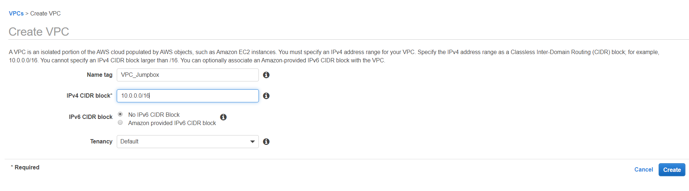
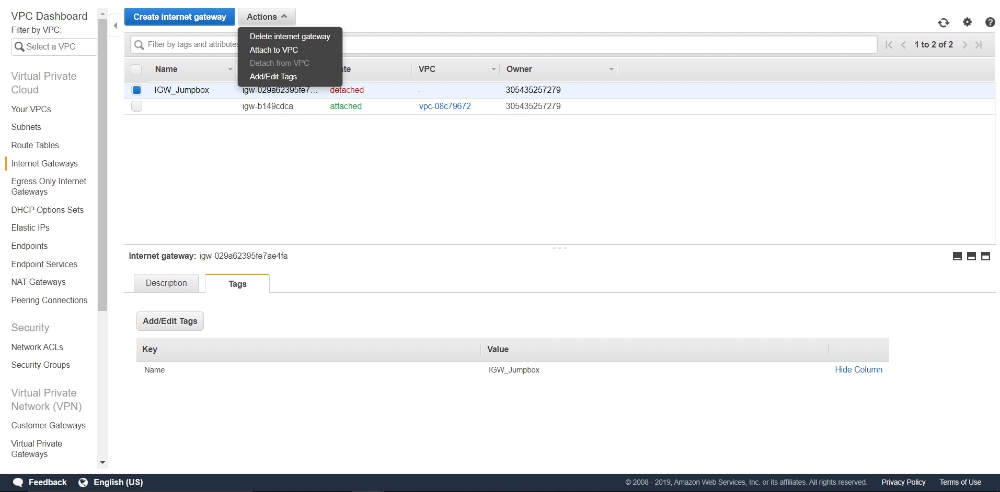
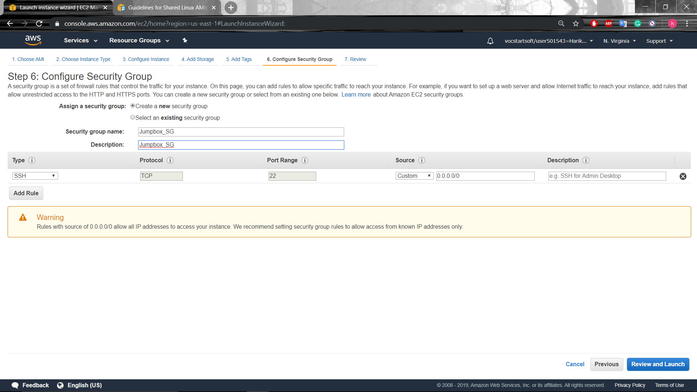
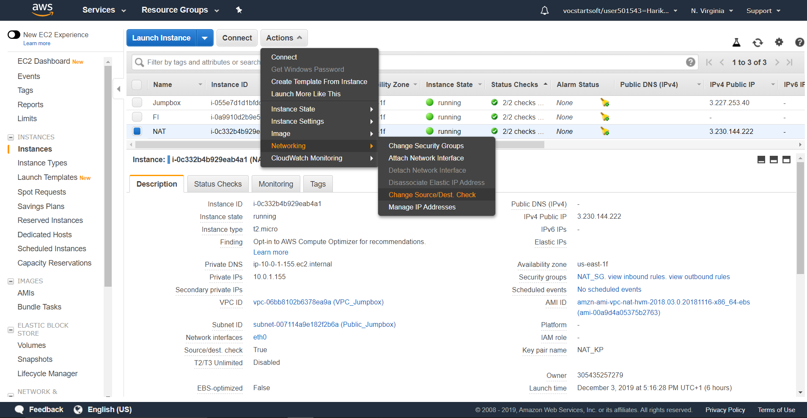
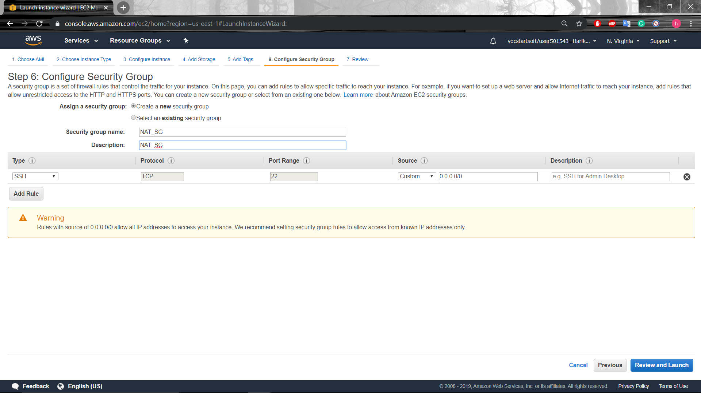
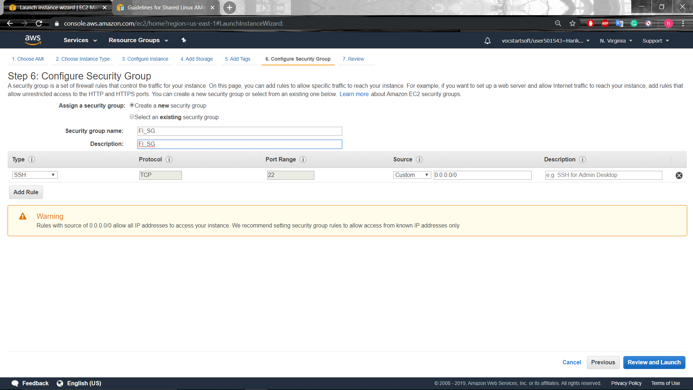
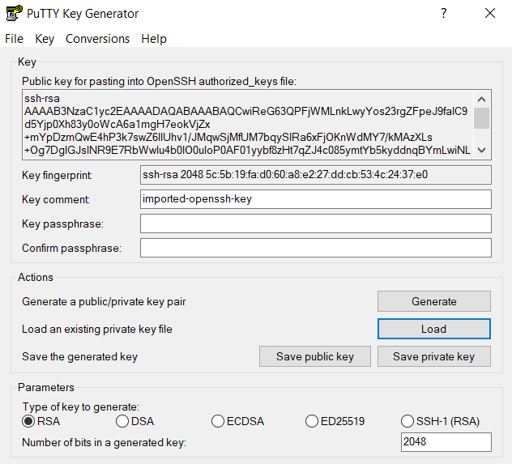
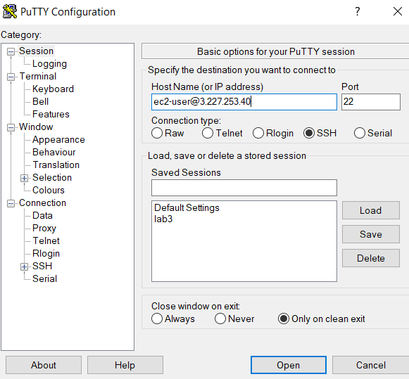
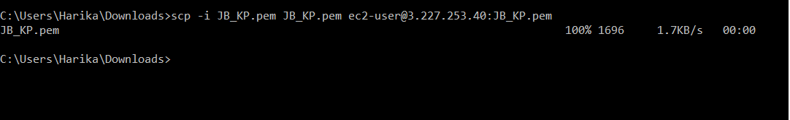
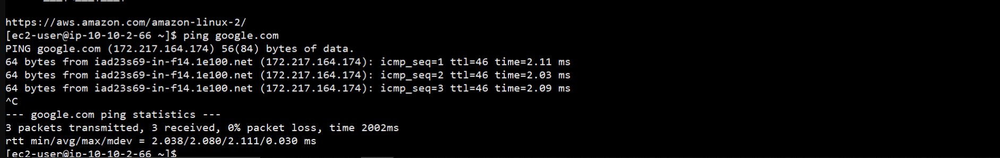

# Accessing internet through Jumpbox and NAT instance
### Create VPC
Create and launch VPC with CIDR block - 10.0.0.0/16

### Create Subnets
Create a public and a private subnet, both linking to the VPC.
For public subnet, CIDR - 10.0.1.0/24
For private subnet, CIDR - 10.0.2.0/24
### IGW
Create a Internet GateWay and attach it to the VPC.

### Launch Instances
* Launch Jumpbox as an EC2 Instance
Launch an EC2 instance in the public subnet and enable public IP address.
* Launch a NAT Instance
Launch a NAT Instance in the public subnet, from community AMIs --> amzn-ami-vpc-nat.
* Launch a Final Instance
Launch another instance(here called final instance) in the private subnet
Saving the keypairs(.pem) is really important to access the instances.
### Edit Route Table
The route table of the NAT instance should be connected to IGW.
The route table of the private instance is to be connected to the IGW through the public instance(NAT).
### Editing the SGs
Each instance have to be connected with its corresponding security group.
- ***Jumpbox*** - Allow all the inbound and outbound traffic.

- ***NAT*** - Allow inbound from final instance and all outbound traffic.
  - Disable the *Change Source/Dest Check* in Networking.
 
 
- ***Fincal Instance*** - Allow inbound from Jumpbox(or local) and all outbound traffic.
The final instance has to accessed only through the jumpbox.

### Puttygen and Putty
Use puttygen to convert .pem file to .ppk format. Load the existing file and save as a private key.

Once converted, launch putty with the IP address of the Jumpbox. Browse and load the keypair(.ppk).Go to session and save the session for future access.

Copy the keypair to jumpbox.
```
scp -i Key Pair Name Key Pair Name ec2-user@"JumpBox IPv4 Public IP:Key Pair Name
```

### Ping google.com

